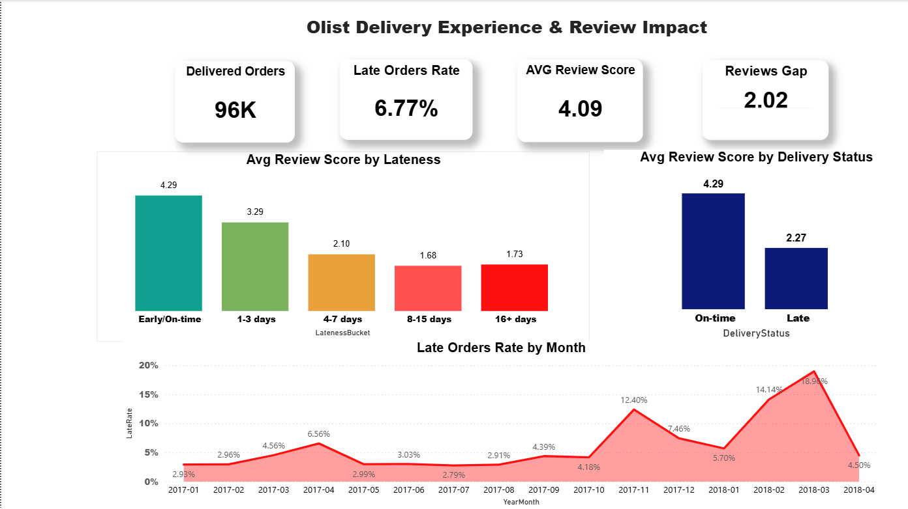

# Late Deliveries Are Quietly Destroying Olist's Review Scores

A SQL case study on the Brazilian e-commerce dataset (~100k orders, 2016-2018), built in PostgreSQL (Supabase).

## The Business Question

Olist is a marketplace. Reviews drive seller rankings, buyer trust, and ultimately conversion. If something systematically tanks review scores, it is not a customer service annoyance. It is a revenue problem.

This analysis asks: how much does delivery performance actually drive review scores, and where should Olist act to fix it?

## Hypothesis

Late deliveries cause measurably lower review scores, and the damage scales with the length of the delay. The effect is large enough to justify operational investment in delivery reliability.

## How lateness is defined

An order is late when it is delivered on a later calendar day than the estimated delivery date. Delivery on the estimated day counts as on time, regardless of the hour. This matters because the estimated date is stored at midnight, so a raw timestamp comparison would flag an order delivered at 2pm on the promised day as late. An earlier version of these queries used that timestamp comparison while the Power BI model used calendar days, which surfaced a roughly 1.2 point gap in the reported late rate. Tracing the gap to the midnight boundary and standardizing every query on the calendar-day rule is what reconciled the two tools. Findings 1 through 3 below use the calendar-day definition; findings 4 and 5 are flagged where their numbers still await a re-run.

## Key Findings

### 1. Lateness is structural, and it got worse as Olist scaled

The late delivery rate climbed as order volume grew. Monthly volume rose ~2.7x between March 2017 and March 2018, while the late rate went from about 4.6% to 19.0% over the same window. At the peak, nearly 1 in 5 orders arrived after the promised date. Delivery capacity did not scale with demand.

| Period | Late rate |
|--------|-----------|
| Most of 2017 | 3-5% |
| Nov 2017 | 12.4% |
| Feb 2018 | 14.1% |
| **Mar 2018 (peak)** | **19.0%** |

## Dashboard

A single-page Power BI dashboard turns the five findings into a view an interviewer can read in about thirty seconds.

The layout leads with the evidence in order of strength. Four KPI cards across the top carry the headline numbers: 96,359 delivered orders, a 6.7% late rate, a 4.15 average review, and the 2.02 star gap between on-time and late orders. The hero visual is the dose-response chart, where average review score falls from 4.29 for on-time orders to 1.68 at eight to fifteen days late, colored on a teal-to-coral scale so the decline reads as it drops. To its right, a choropleth of Brazil shades each state by late rate, exposing the Nordeste cluster and the Rio de Janeiro anomaly. The bottom row pairs the monthly late-rate trend, which climbs to nearly 19% by March 2018, with the on-time versus late review split.

Color is consistent across every visual: teal marks reliable delivery, coral marks failure, so the encoding is learned once and applies everywhere.

**Files:** `Olist Case Study.pbix` (interactive) and `Olist_Dashboard.png` (static preview).

### 2. A late order loses 2.02 stars

| Delivery status | Orders | Avg review score |
|-----------------|--------|------------------|
| On time | 89,949 | 4.29 |
| Late | 6,410 | 2.27 |

These on-time and late counts reconcile exactly with the dose-response buckets below: 89,949 early or on-time orders, and 6,410 late orders split across the four delay buckets. On-time orders cluster around "good to great." Late orders cluster around "poor." The delivery experience flips the customer's perception of the entire purchase, regardless of the product itself.

### 3. The damage scales with delay length (dose-response)

| Delay | Orders | Avg review score |
|-------|--------|------------------|
| Early / on time | 89,949 | 4.29 |
| 1-3 days late | 1,856 | 3.29 |
| 4-7 days late | 1,756 | 2.10 |
| 8-15 days late | 1,610 | 1.68 |
| 16+ days late | 1,188 | 1.73 |

Three things stand out:

- Review damage is not binary. Every additional day of delay costs review score.
- The steepest cliff sits between "1-3 days late" and "4-7 days late," where orders lose more than a full star and cross below the scale midpoint.
- Scores bottom out near 1.7 after 8 days. The 16+ bucket's slight uptick is a floor effect, not a recovery: a furious customer gives 1 star whether the order is 8 days late or 30.

The monotonic decline is what makes the relationship credible. A confound would have to mimic this exact dose-response shape to explain it away.

### 4. Late first orders dent retention by ~17% (relative)

_Pending refresh: the figures in this section still use the earlier timestamp-level definition. Re-running the updated query moves some borderline first orders from late to on-time, so the gap is expected to narrow slightly. The direction of the finding is not expected to change._

Among customers whose first order arrived on time, 3.04% placed a second order. Among customers whose first order was late, 2.51% did. That is a 17% relative drop in repeat purchase rate.

Honest caveat: the absolute gap is 0.53 percentage points, and the confidence intervals barely separate. Olist's baseline retention is very low (~3%, mostly one-and-done buyers), so the retention signal is inherently faint. The review-score effect is the stronger, better-evidenced lever. This finding supports the hypothesis directionally rather than proving a revenue impact on its own.

### 5. Geography shows where the problem lives

_Pending refresh: the state rates below still use the earlier timestamp-level definition. Day-level rates run a few points lower across the board, but the ranking (Nordeste worst, RO/AM/SP best) is expected to hold._

| Pattern | States | Late rate |
|---------|--------|-----------|
| Worst (Nordeste cluster) | AL, MA, PI, CE, SE, BA | 14-24% |
| Best | RO, AM, PR, MG, SP | 3-6% |

São Paulo handles 40,495 orders, the highest volume in the dataset, yet posts one of the best late rates (5.9%). Most Olist sellers ship from the SP region, so proximity to the seller hub, not volume, drives reliability.

Two anomalies break the simple distance story and sharpen it:

- **Rio de Janeiro: 13.5% late on 12,353 orders.** RJ sits next door to São Paulo. By distance alone it should perform like SP. Instead it runs at more than double SP's late rate, worse than several remote northern states. Last-mile complexity (urban congestion, difficult delivery zones) operates as an independent failure mode.
- **Amazonas: 4.1% late.** Remote, deep in the Amazon, yet among the best performers. Deliveries concentrate into Manaus, making the footprint compact and serviceable.

Refined conclusion: distance from the SP seller hub explains most of the variation, but last-mile logistics complexity matters independently. Fixing "the North" will not fix RJ.

## Recommendations

Ranked by expected impact, each tied to a specific finding:

**1. Make "under 3 days late" the operational red line.**
The dose-response curve shows the steepest review damage occurs when a delay crosses from 1-3 days into 4-7 days (3.29 down to 2.10). Olist cannot eliminate every miss, but containing misses under 3 days preserves most of the review score. Concretely: when a shipment is flagged at risk, prioritize it for expedited handling before it crosses the 3-day threshold. Triage by delay severity, not by a binary late flag.

**2. Fix the estimate, not just the delivery.**
A "late" order is a broken promise against the estimated date. Olist controls both sides of that equation. In corridors with chronic misses (SP to Nordeste), widening the delivery estimate converts a 2-star "late" experience into an on-time one at zero logistics cost. Test estimate padding in the worst corridors and measure the review impact before spending on freight.

**3. Audit Rio de Janeiro as a last-mile problem, separate from the distance problem.**
RJ runs at 13.5% late despite sitting next to the seller hub. Treating it like a distance problem (more warehouses, closer inventory) would waste money. The fix is last-mile: carrier performance review, delivery zone analysis, possibly alternative pickup points in hard-to-serve neighborhoods.

**4. Replicate the proximity model for the Nordeste.**
The SP region works because sellers sit near customers. The Nordeste cluster (AL, MA, PI, CE, SE, BA at 14-24% late) is the inverse. Recruiting sellers in or near Salvador and Fortaleza, or staging inventory there, attacks the structural cause rather than the symptom.

**5. Track late rate as a leading indicator during growth.**
The 2017-2018 degradation shows what happens when volume outruns capacity: the late rate roughly quadrupled in a year and peaked near 19%. Late rate should sit on the operational dashboard with an alert threshold, because review scores follow it with a lag.

## Limitations

- **Observational data, not an experiment.** Late delivery correlates with other failure modes (damaged goods, wrong items, poor seller communication). The dose-response pattern strengthens the causal case but cannot close it. A randomized estimate-padding test (Recommendation 2) would.
- **Faint retention signal.** Olist's ~3% repeat rate leaves little room to detect retention effects. The 17% relative drop is borderline significant.
- **Review self-selection.** Customers with extreme experiences review more often, which may amplify the measured gap.
- **Dataset ends in 2018.** Findings describe Olist's scaling period, not its current operations.

## Tools

PostgreSQL (Supabase), Power BI (dashboard), GitHub.

## Future Extensions

- Statistical validation in Python: correlation between delay days and review score, significance testing on the retention gap
- Freight cost vs delay analysis: does paying more for shipping actually buy reliability?
- Seller-side view: do chronically late sellers churn off the platform?
